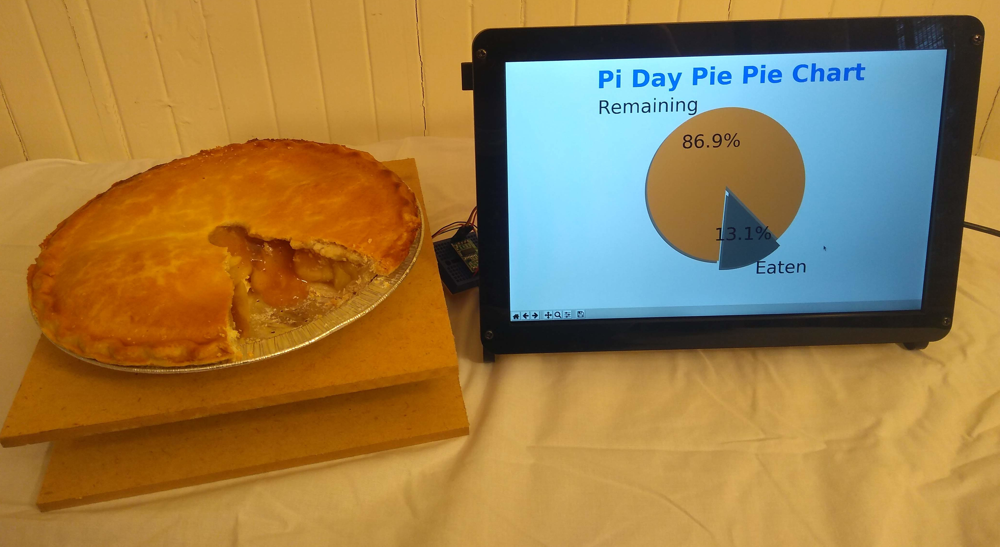

# Pie Pie Chart

`pie_pie_chart.py` is a pie pie chart for Pi Day powered by the Raspberry Pi.

A pie is pie chart that shows how much pie is left. To verify this, we have
created a real-time pie measurement and reporting device which continuously
weighs the amount of pie that is left. The viewing screen, juxtaposed with the
pie in question, provides immediate visual confirmation that the pie chart made
by the original pie is accurate.

Happy Pi Day!

## Materials needed

* 2 cups all-purpose flour
* [Load Cell - 5kg](https://www.sparkfun.com/products/14729?_ga=2.24515706.1936956039.1552598453-1561457067.1552166144&_gac=1.115816181.1552174572.Cj0KCQiA5Y3kBRDwARIsAEwloL46FxiD3YNyOx13p7sVzKgmAnDuFhzwXxAw4RRtC2iJ8tYv5psYXeoaAgeIEALw_wcB)
* 1 tablespoon sugar
* [Load Cell Amplifier - HX711](https://learn.sparkfun.com/tutorials/load-cell-amplifier-hx711-breakout-hookup-guide/all)
* 1/2 teaspoon salt
* [Raspberry Pi 3 Model B+](https://www.raspberrypi.org/products/raspberry-pi-3-model-b-plus/)
* 3/4 cup shortening
* [11.1" LCD Screen](https://www.robotshop.com/en/1280x800-101-lcd-ips-screen-raspberry-pi.html?gclid=CjwKCAjw96fkBRA2EiwAKZjFTU8E2x6RaMLMpzV93_2UvaS4hqcBabY84NoMAyt84qUMzNkNBTGt7xoCQUUQAvD_BwE)
* 1 egg, lightly beaten
* 8GB Micro SD card
* 3 tablespoons cold water
* 5 cups fresh or frozen unsweetened raspberries, thawed
* tiny breadboard
* 1 tablespoon white vinegar
* hookup wires
* 1-1/3 cups sugar
* Two 8" x 8" x 1/8" pieces of wood or plastic
* 2 tablespoons quick-cooking tapioca
* Two 4M x 10mm screws
* 2 tablespoons cornstarch
* 1 tablespoon butter
* Two 5M x 10mm screws
* 1 tablespoon sugar
* Two 4M spacers
* 1 tablespoon 2% milk
* Two 5M spacers

## Tools needed

* Rolling pin
* Two large mixing bowl
* Soldering iron
* 9" pie plate
* Refridgerator
* Oven
* Wire stripper
* Set of measuring cups and spoons

## Instructions

1. In a large bowl, combine the flour, sugar and salt; cut in shortening until
mixture resembles coarse crumbs.

1. Download and install Raspbian to an SD card and boot your RaspberryPi
following [the instructions](https://www.raspberrypi.org/downloads/raspbian/)
on their website. This project has been tested on version
2018-11-13-raspbian-stretch-full but most any version should work.

1. Combine the egg, water and vinegar; stir into flour mixture just until
moistened.

1. Drill holls in each 8"x8" sheet to support load cell.

1. Divide dough in half so that one ball is slightly larger than the other;
wrap each in plastic wrap.

1. Secure load cell between sheets separated by spacers.

1. Refrigerate (dough not load cell) for 30 minutes or until easy to handle.

1. Use the breadboard and wires to connect the HX711 load cell to the
RaspberryPi. Follow [this tutorial](https://tutorials-raspberrypi.com/digital-raspberry-pi-scale-weight-sensor-hx711/)
and test to make sure you're getting a reading using their example script.

1. Meanwhile, in another large bowl, combine the sugar, tapioca, cornstarch and
raspberries; let stand for 15 minutes.

1. Download this repository to the Raspberry Pi.

    git clone https://github.com/mmachenry/pie-pie-chart.git

1. On a lightly floured surface, roll out larger ball of dough to fit a 9-in.
pie plate. Transfer dough to pie plate; trim even with edge. Add raspberry
filling; dot with butter.

1. Change working directory to the project code.

    cd pie-pie-chart/

1. Roll out remaining dough to fit top of pie; place over filling. Trim, seal
and flute edges. Cut slits in top. Brush with milk; sprinkle with sugar.

1. Install dependencies.

    pip3 install -r requirements.txt

1. Bake at 350° for 50-55 minutes or until crust is golden brown and filling is
bubbly. Cool on a wire rack.

1. Run script and place pie on scale when prompted.

    python3 pie_pie_chart.py

## References

* https://www.raspberrypi.org/downloads/raspbian/
* https://www.tasteofhome.com/recipes/favorite-fresh-raspberry-pie/
* https://tutorials-raspberrypi.com/digital-raspberry-pi-scale-weight-sensor-hx711/
